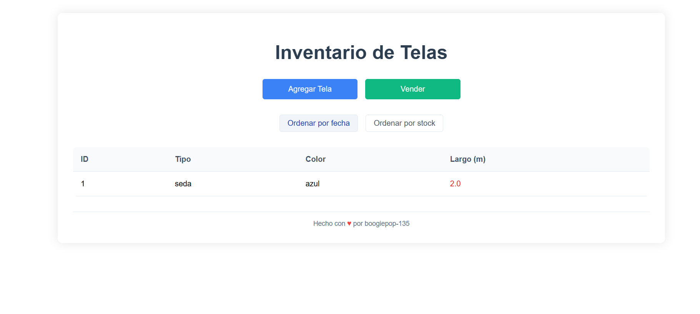

# Sistema de Inventario Textil

Control simple de inventario de telas.

## Capturas de Pantalla

### Página Principal


### Formulario de Venta


## Instalación

### Opción 1: Docker (Recomendado)
```bash
git clone <repositorio>
cd PreubaTecnicaVendy
docker-compose up -d
```
Abre http://localhost:8000

### Opción 2: Manual
1. Instala XAMPP/WampServer
2. Copia archivos a htdocs/www
3. Importa `sql/esquema.sql`
4. Abre http://localhost/PreubaTecnicaVendy

## Credenciales MySQL
- Host: localhost
- Usuario: root
- Password: (vacío)
- Puerto: 3306

## Estructura
```sql
CREATE TABLE telas (
    id INT AUTO_INCREMENT PRIMARY KEY,
    tipo VARCHAR(100) NOT NULL,
    color VARCHAR(50) NOT NULL,
    largo FLOAT NOT NULL,
    fecha_ingreso DATE NOT NULL
);
```

## Opciones de Despliegue Gratuito

### Railway
1. Crear cuenta en [Railway](https://railway.app)
2. Conectar con GitHub
3. Importar repositorio
4. Agregar servicio MySQL desde el panel
5. Railway proporcionará las variables de entorno automáticamente

### Render
1. Crear cuenta en [Render](https://render.com)
2. Crear "Web Service" y conectar con GitHub
3. Crear base de datos MySQL desde "New+" 
4. Configurar variables de entorno con credenciales

### Netlify + PlanetScale
1. Desplegar frontend en [Netlify](https://netlify.com)
2. Crear base de datos gratuita en [PlanetScale](https://planetscale.com)
3. Conectar usando credenciales de PlanetScale
4. Configura las variables de entorno en Netlify

Nota: Estas opciones incluyen planes gratuitos con algunas limitaciones, pero suficientes para pruebas y proyectos pequeños.

